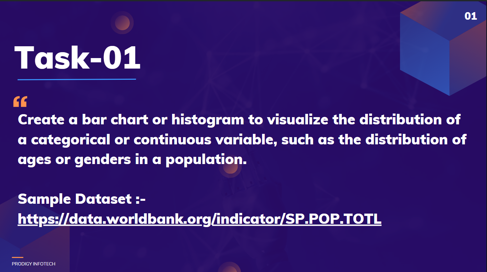
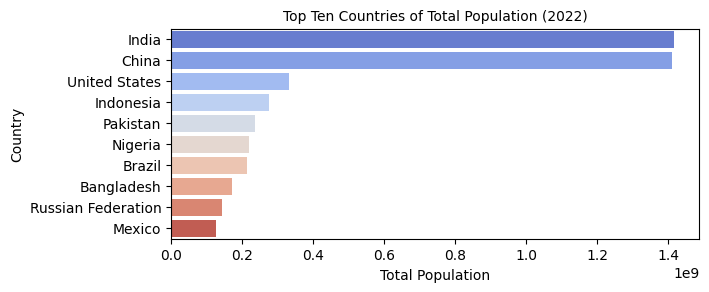
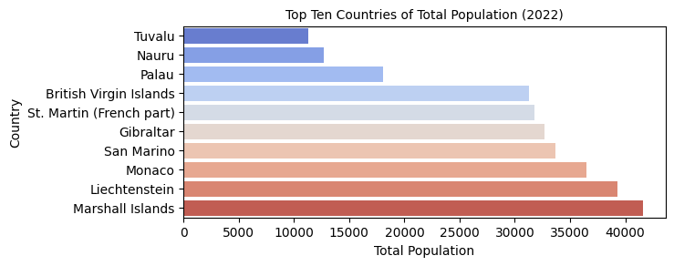
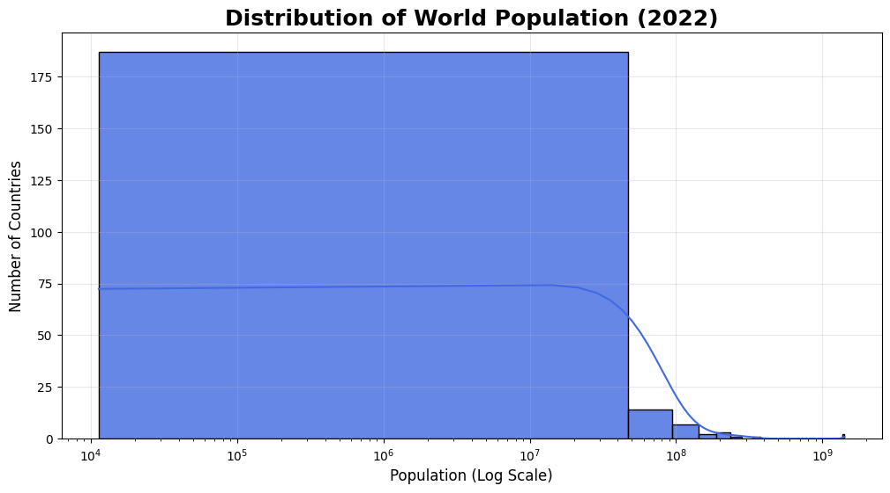
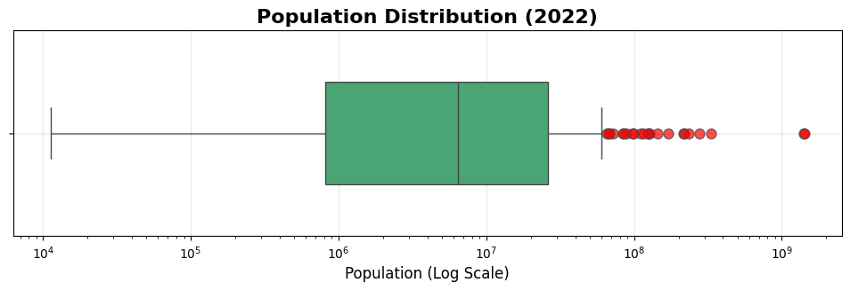
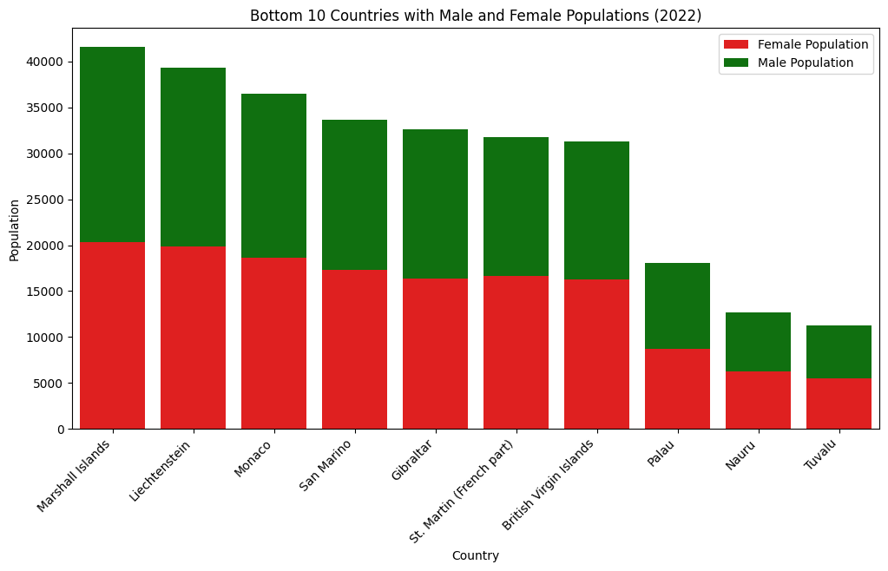

# PRODIGY_DS_01 - World Population Distribution Analysis

<p align="center">
  
</p>

## Project Overview

This project was completed as part of the Prodigy InfoTech Data Science Internship Program.

The objective of this task was to create visualizations that effectively represent the distribution of a continuous variable using real-world population data. The analysis explores global population trends, demographic patterns and population disparities across countries using various statistical and visual techniques.

---

## Objective

- Analyze world population data across countries.
- Visualize population distributions using charts and graphs.
- Identify the most and least populated countries.
- Compare male and female population distributions.
- Extract meaningful insights from demographic data.

---

## Dataset

The dataset contains country-wise population statistics from 2001 to 2022, including:

- Total Population
- Male Population
- Female Population
- Historical Population Records
- Country Demographic Information

---

## Technologies Used

- Python
- Pandas
- NumPy
- Matplotlib
- Seaborn
- Jupyter Notebook

---

## Data Preprocessing

The following preprocessing steps were performed:

- Dataset inspection and validation
- Missing value analysis
- Duplicate value checking
- Data type verification
- Data filtering and sorting
- Population ranking and comparison

---

## Visualizations

### Top 10 Countries by Population (2022)

<p align="center">
  
</p>

### Bottom 10 Countries by Population (2022)

<p align="center">
  
</p>

### Distribution of World Population (2022)

<p align="center">
  
</p>

### Population Distribution Box Plot

<p align="center">
  
</p>

### Bottom 10 Countries by Male & Female Population

<p align="center">
  
</p>

---

## Key Insights

- Global population distribution is highly right-skewed, with a few countries accounting for a significant share of the world's population.
- India and China dominate the population rankings and appear as major outliers.
- Most countries have populations below 100 million.
- Population rankings remain relatively stable across the years analyzed.
- Male and female population distributions closely follow overall population trends.
- Significant demographic differences exist between highly populated and low-population countries.
- Small island nations and territories consistently appear among the least populated regions.
- Population data exhibits substantial variation, highlighting global demographic diversity.

---

## Project Structure

```text
PRODIGY_DS_01/
│
├── worldpopulationdata.csv
│
├── Prodigy_Infotech_Task_1.ipynb
│
├── images/
│   ├── ds1.png
│   ├── top10_countries_population_2022.png
│   ├── bottom10_countries_population_2022.png
│   ├── histogram_population.png
│   ├── boxplot_population.png
│   └── bottom10_countries_male&female_population.png
│
├── README.md
```

---

## Results

The analysis successfully visualized global population distribution patterns, identified demographic outliers, and demonstrated how data visualization techniques can be used to understand population trends and disparities across countries.

---

## Internship Task

**Task 01: Data Visualization**

Create a bar chart or histogram to visualize the distribution of a categorical or continuous variable.

Completed as part of the **Prodigy InfoTech Data Science Internship Program**.